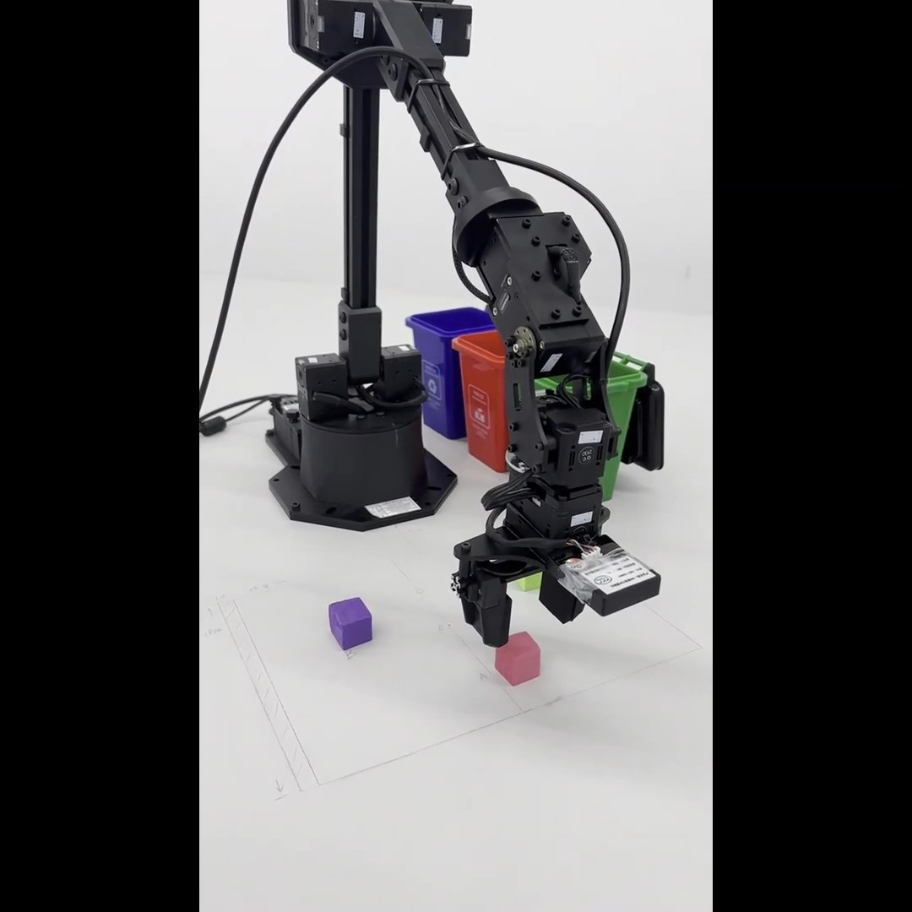
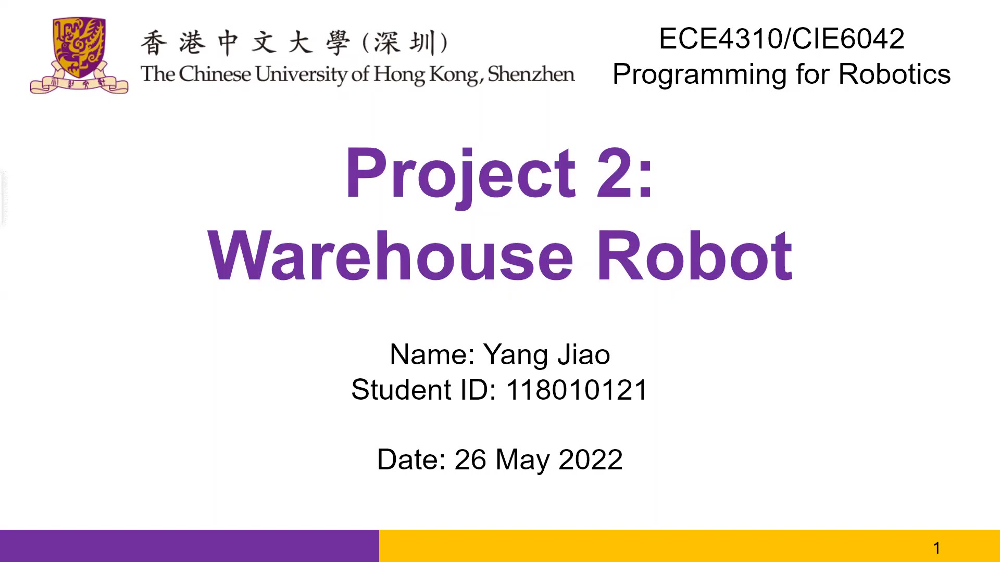

# warehouse-manipulation

Visual-based grasping with a 6-dof robot arm.

This is a repo for the warehouse manipulation project of the course [Programming for Robotics](https://www.cuhk.edu.cn/en/course/8447) at [CUHK-Shenzhen](https://www.cuhk.edu.cn/en).

Local environment: Ubuntu 20.04 + ROS Noetic

## Project Demo

Click on the image below to redirect to the video for demonstration.

## Project Presentation

Click on the image below to redirect to the video for the presentation.

